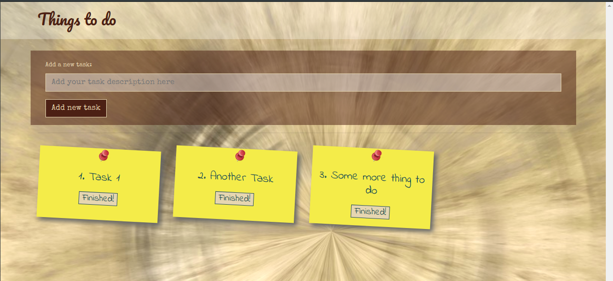

# JS ToDoList

_Javascript To-Do-List - Add and remove tasks dynamically_

---
#### **[Visit Poject Site &raquo;](https://playground.odras.de/ToDoList/)**
---

## Features
- Add and remove tasks
- Store items in local storage

## Technologies
- JavaScript
- HTML/CSS/SCSS
- WebPack
- Bootstrap
